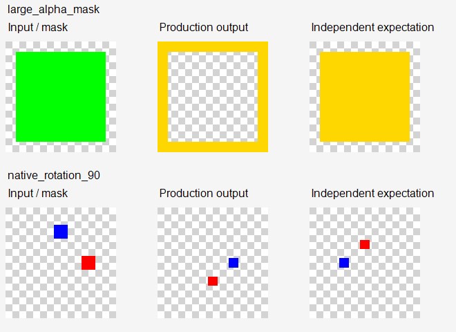

# 纹章合成离线验收：未通过（2026-09-16）

结论：建议重做 `BannerEmblemComposer` 的渲染核心，保留参考图归属标签、发送、缓存与生命周期接口。当前实现不仅会漏图，还可能产出形状、颜色、描边和旋转错误的非空图。上一轮空图检测修复有效，但不能证明渲染正确。

本轮只做离线验收和重做范围分析，未修改生产代码、未部署、未调用生图服务。审计工具提交 `5de6e6c9`；被测生产源码 `90a61c9f`，检查点 `da48d08`。

## 实际执行与范围

两次独立进程分别加载 BannerlordApi 1.3 / 1.4 目标 DLL。每版 **30 checks / 7 failures**（23 通过）。脚本失败退出码为 1，没有放宽断言使其通过。

```powershell
powershell -NoProfile -ExecutionPolicy Bypass -File tools/test_illustrator_emblems.ps1 -BannerlordApi 1.3
powershell -NoProfile -ExecutionPolicy Bypass -File tools/test_illustrator_emblems.ps1 -BannerlordApi 1.4
```

默认读取当前 `extensions/AnimusForge.Illustrator/bin/test/<版本>/AnimusForge.Illustrator.dll`；先用现有 `tools/test_illustrator.ps1` 构建即可。输出位于 `artifacts/tests/emblem-offline-<版本>`。首次审计完整输出保留在 `artifacts/tests/emblem-offline-audit/before-1.3` 和 `before-1.4`；该 before 命名仅代表待重做的现有实现，没有已完成的 after 版本。

- 1.3 DLL SHA256：`DF90708677486BABB9E98AA3EA81B221830B1A66F71D9D8A7AA7CB669867C61B`
- 1.4 DLL SHA256：`F59E11E604BF184D32E1CE5486B305979BABB5D9A7D632F4DFDA38B9AD8C8AFB`
- 测试直接反射调用编译后的 `ExtractAtlasCell / TintIconCell / DrawPiece / HasVisibleContent`，没有复制生产着色逻辑作为期望值。
- 覆盖 16 个图集格位、普通/大面积/反相掩码、注释声称的红通道优先规则、描边、四个角度乘两种镜像组合，以及真实旧空切片。
- 真实样本 `tools/illustrator/fixtures/cell_162_raw.png` 来自用户本机故障调试文件，是已损坏的负例，不能当作正确图集。其余图是人工构造的离线算法样本。
- 两版都只执行 CPU 算法，依赖使用本机可用托管程序集；不等同于在两套真实游戏中运行，更没有执行原生 `ResolveJob → SaveToFile → ComposeBitmapsAsync` 全链路。

## 失败结果

| 问题 | 可复现结果 | 生产源码定位（90a61c9f） |
|---|---|---|
| 大面积图案反相 | 64×64 中的 52×52 不透明方形，被处理成空心边框；4096 个像素全部与期望不同，中心 Alpha 从 255 变 0。小面积同类样本正常。 | `extensions/AnimusForge.Illustrator/src/Engine/BannerEmblemComposer.cs:480–493`，按覆盖率超过 55% 判断反相。面积无法判定纹理编码。 |
| 配色与自身契约冲突 | 文档声称 R 优先；R/G 同为 255 时却把金色和蓝色平均成 RGB(127,107,127)。 | 同文件 `464–512`，`TintIconCell` 实际做归一化混色。这个用例证明实现和注释矛盾，**不证明原生 shader 一定应当采用测试图中的纯蓝色**。 |
| 描边无效 | 开启前后可见像素均为 1024；目标剪影周围没有新增描边。 | 同文件 `534–551`，`ApplyStroke` 把 `ColorMatrix.Matrix33` 设为 0，偏移描边变成完全透明；并未传入原版 `ColorId2` 描边色。 |
| 旋转方向错误 | 90° / 270°，含镜像的四项均失败。90° 时应向上的红色标记向下，位置差 32 像素。0° 与 180° 对照通过。 | 同文件 `557–565`，`DrawPiece` 直接把游戏角度用于 Y 轴向下的 GDI+ 坐标。 |

旋转独立依据：原版 `原版游戏本体代码1.4.5/TaleWorlds.MountAndBlade.View/TaleWorlds/MountAndBlade/View/BannerVisual.cs:41–60` 的 `GetMeshMatrix`；`原版游戏本体代码1.4.5/TaleWorlds.Library/TaleWorlds/Library/Mat3.cs:79–86` 的 `RotateAboutUp`；`BannerTextureCreator.cs:102–110` 的相机 up=(0,1,0)。期望图是这些坐标规则的数学投影，并非实机截图。

已有修复有效的部分：16 格 CPU 取格、小面积与反相样本、0°/180°和镜像、真实空切片拒绝均通过。双色背景仍由 `ResolveJob` 主动省略，原生背景 mesh 的还原不在当前实现覆盖内。

## 图像对照

每行从左到右：输入、当前生产输出、独立期望。红通道优先与描边的期望只代表已声明契约/人工形态，不是原生 shader 金标准。



[完整六组对照](assets/illustrator-emblem-20260916/comparison.png)；[1.3 原始结果](assets/illustrator-emblem-20260916/results-1.3.json)；[1.4 原始结果](assets/illustrator-emblem-20260916/results-1.4.json)。所有对照图均已查看。

## 应重做的范围

优先让游戏原有纹章渲染承担背景网格、图标纹理、配色、描边、镜像与旋转。已核实 1.4 源码 `BannerImageTextureProvider.OnCreateImageWithId` 使用 `BannerThumbnailCreationData` 和 `ThumbnailCacheManager.Current.CreateTexture`；`BannerTextureCreator` 以 `Banner.ConvertToMultiMesh` 渲染。1.3 的具体适配与渲染完成契约仍须在重做时核实。

新的模块责任应收缩为：主线程冻结 BannerCode → 请求/复用原生纹章图 → 等待完成并安全导出 → 验证尺寸/非空 → 缓存结果 → 按正确角色归属发送参考图。缓存需含完整 BannerCode、尺寸、版本/资源变化因素；请求取消、scope 失效与超时仍必须贯穿。不能直接回退到以前自建 Scene、强转共享 RenderTarget 或临时可见舞台的旧路径。

如仍保留 CPU 渲染，必须先取得一套未经损坏的原生 PNG 与对应 BannerCode，确认通道/Alpha/shader 规则再实现确定性解码，不能继续以面积阈值猜编码。验收至少包括：原版单图标、复杂多层、双色背景、90°/270°、镜像、不同描边、自定义 MOD 图集；对同一 BannerCode 做原生与导出像素/视觉对照。

本轮新增工具只在手工运行时执行，无游戏运行频率或性能变化。未覆盖原生 GPU 导出方向/通道、原生 shader 精确效果、复杂背景、实际模型是否忠实复制纹章。不能把本轮的通过用例或此前 185 项通用回归当作纹章保真验收通过。

回滚：定向 revert `5de6e6c9` 可撤销本轮审计工具；无需回滚生产代码。本报告与随附结果是失败证据，后续重做应保留并补充正确的原生参考样本。
